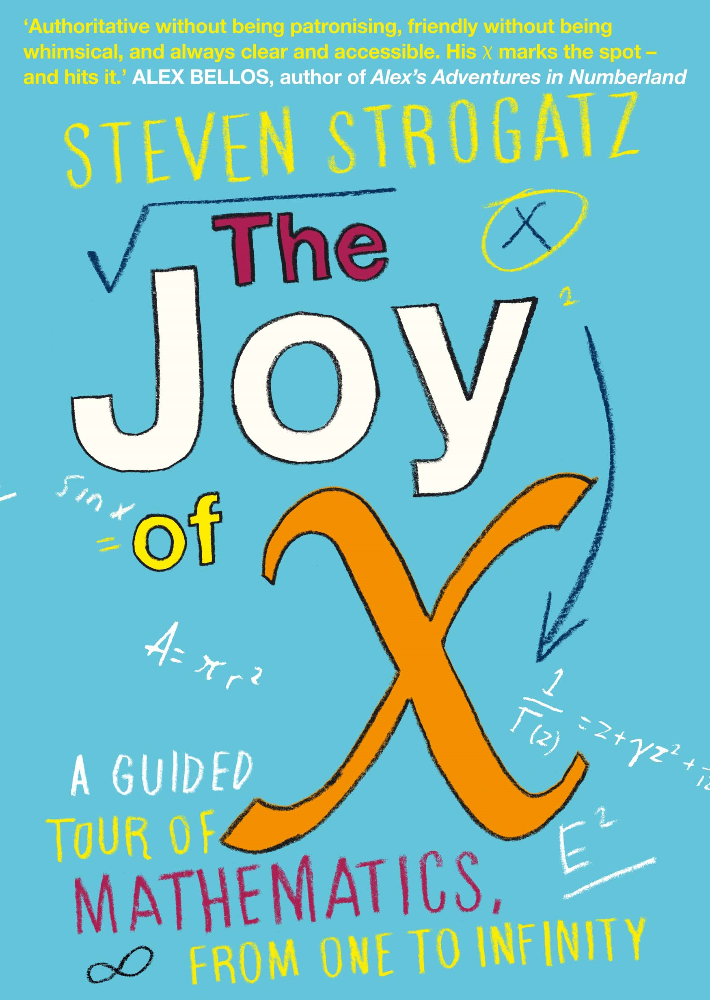

I think mathematics education has a systemic problem from the earliest years. At the primary and even pre-schooling levels, children are taught concepts such as pattern finding and are introduced to numbers by people who they themselves frequently have a limited understanding of mathematics. That's not to say they teach it badly, but I noticed in my own schooling that many of my teachers clearly had a fear of maths themselves, and it meant that at times they couldn't teach us properly.

Being an insomniac, there's not a lot to do except think as you stare at the ceiling and pray that sleep eventually hits you like a runaway bus. So, I've always played with maths as I lie there. Sometimes I wonder if that's why I'm an insomniac: Once I start thinking, I can't switch off until I have an answer, even if it means writing a 300-line program at 2 a.m. to prove something to myself. Regardless, it has always provided me with interesting thought experiments to perform, and definitely expands on the ability to mentally process complicated problems.

The turning point for me was being stuck in "mandatory reading time" once a week in English class. Fiction stopped appealing to me early, and it was always dull forcing myself to read something for a book report when you frankly didn't care what the author's purpose was, and that stating it was a financial purpose often landed you in detention (all too often at that). One day, I found a copy of Steven Strogatz's *The Joy of X* and it fundamentally changed my life trajectory. The book is a very soft, non-rigorous introduction to mathematics from the most basic concepts all the way to some of the cutting-edge new research in the field. The explanations are intuitive and more importantly, make you think about maths without needing to think of equations, something many people find abhorrent. It was this book that started to change my perspective on mathematics. I went from "*how can I use calculus to find this instantaneous velocity at time $t$*" to "*how are we doing anything on an infinitesimally small space???*"

Calculus is an excellent example of this, as while it is fundamentally useful for many things (as the engineer and other statisticians I live with will attest to), it is also a beautiful concept in and of itself. Think about it: we are claiming that we know the gradient between two points so small we cannot even measure it, and have to define limits to even comprehend exactly what we mean. Integration considers "the area under a graph" absolutely, but the Riemann integral defines this as dividing the region using rectangles so narrow their width approaches zero, but never reaches such a value, and that we then sum the area of these borderline area-less rectangles. This concept in particular is of use whenever I have to explain the difference of continuous and discrete random variables, but this presupposes not only the knowledge that this is a definition of an integral, but also sufficient interest to let me explain why infinitely thin rectangles are useful for your clearly non-rectangular curve.

*The Joy of X* was probably the turning point of my teenage years in many ways. Today, I find it somewhat ironic that after years of building my understanding of algebra, trigonometry, calculus, set theory, statistical inference, and a range of other topics, my research is largely wondering why I can't force a knock-off brain analogue (neural network) to do exactly what I want. Although I don't use much of my previous studies in my work, it is incredibly rewarding to understand how the affine transformations and automatic differentiation behind the neural network are operating, and even more so that I now have sufficient understanding to self-teach more concepts.

The statistics department at the University of Auckland has an excellent reputation, and stellar staff who are plenty willing to spend half an hour of their day explaining their theoretical basis for Bayesian sandwich estimators to someone they just met, or how conditioning an unbiased estimator on a sufficient statistic will guarantee equal or lower variance while maintaining its unbiasedness; something I am extremely grateful for.

Moral of the story? Read a book, it might change your life.

